# Diagrams & Charts
## About Mermaid

[Mermaid project](https://github.com/mermaid-js/mermaid) is great
little piece of software to generate flowcharts, sequence diagrams,
class diagrams, state diagrams, Gantt or Pie charts using markdown
like syntax.

## Examples

See the [upstream documentation](http://mermaid-js.github.io/mermaid/)
for more authoritative documentation and examples. There is also a on
[online live editor](online live editor) for those that don't have a
[good local IDE](https://emacs.sexy/) already setup. :wink:

### Graph Example 1

```markdown
graph TB
    A[Hard edge] -->|Link text| B(Round edge)
    B --> C{Decision}
    C -->|One| D[Result one]
    C -->|Two| E[Result two]
```

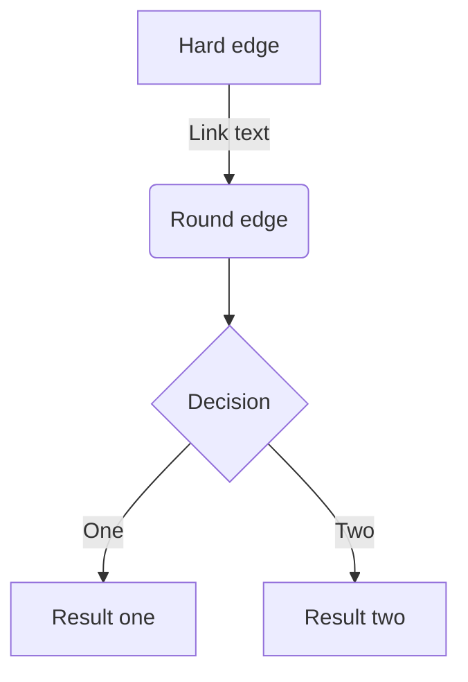


### Graph Example 2

```markdown
graph LR
    A[Square Rect] -- Link text --> B((Circle))
    A --> C(Round Rect)
    B --> D{Rhombus}
    C --> D
```

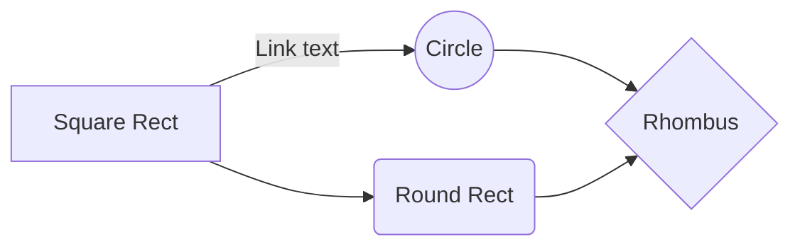

### Graph Example 3

```markdown
graph TB
         subgraph one
         a1-->a2
         end
         subgraph two
         b1-->b2
         end
         subgraph three
         c1-->c2
         end
         c1-->a2
```

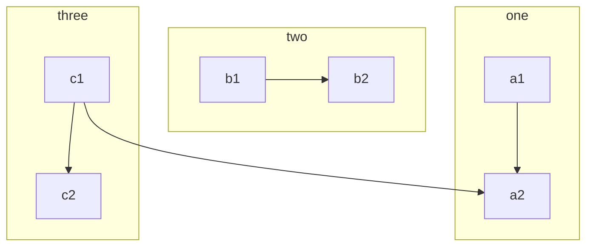

### Graph Example 4

```markdown
graph TB
    sq[Square shape] --> ci((Circle shape))

    subgraph A subgraph
        od>Odd shape]-- Two line<br>edge comment --> ro
        di{Diamond with <br/> line break} -.-> ro(Rounded<br>square<br>shape)
        di==>ro2(Rounded square shape)
    end

    %% Notice that no text in shape are added here instead that is appended further down
    e --> od3>Really long text with linebreak<br>in an Odd shape]

    %% Comments after double percent signs
    e((Inner / circle<br>and some odd <br>special characters)) --> f(,.?!+-*ز)

    cyr[Cyrillic]-->cyr2((Circle shape Начало));

     classDef green fill:#9f6,stroke:#333,stroke-width:2px;
     classDef orange fill:#f96,stroke:#333,stroke-width:4px;
     class sq,e green
     class di orange
```

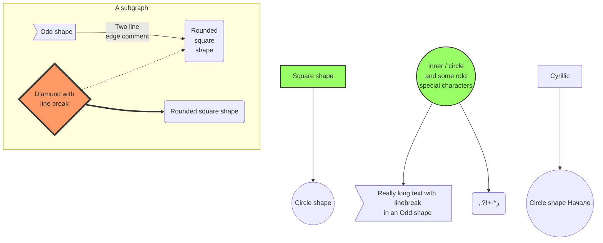

### Sequence Diagram Example 1

```markdown
sequenceDiagram
    Bruce->>Steve: Hey, can we get a raise?
    Steve-->>Bruce: Sorry, I got The Look.
    Bruce->>Steve: What look?
    Steve-->>Bruce: The Look.
    Bruce->>Steve: Uh, what does that mean?
    Steve-->>Bruce: Nancy gave me The Look.
    Bruce->>Steve: So, did you even ask her?
    Steve-->>Bruce: No. I got The Look.
    Bruce->>Steve: So, do we get our raise or not?
    Steve-->>Bruce: No. Nothing I can do.
```

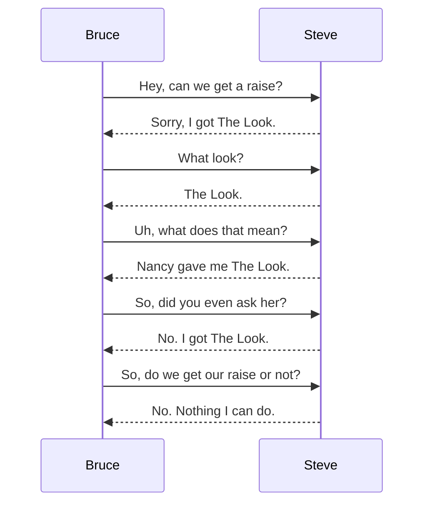

### Sequence Diagram Example 2

```markdown
sequenceDiagram
    Alice ->> Bob: Hello Bob, how are you?
    Bob-->>John: How about you John?
    Bob--x Alice: I am good thanks!
    Bob-x John: I am good thanks!
    Note right of John: Bob thinks a long<br/>long time, so long<br/>that the text does<br/>not fit on a row.

    Bob-->Alice: Checking with John...
    Alice->John: Yes... John, how are you?
```

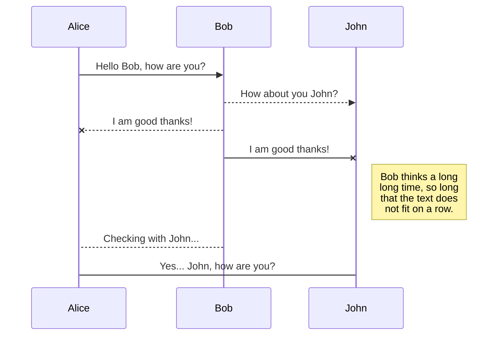

### Sequence Diagram Example 3

```markdown
sequenceDiagram
    loop Daily query
        Alice->>Bob: Hello Bob, how are you?
        alt is sick
            Bob->>Alice: Not so good :(
        else is well
            Bob->>Alice: Feeling fresh like a daisy
        end

        opt Extra response
            Bob->>Alice: Thanks for asking
        end
    end
```

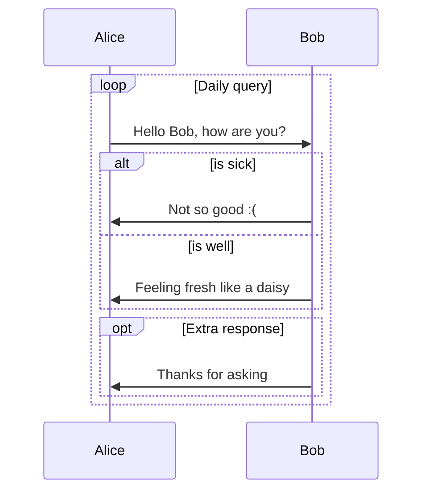

### Sequence Diagram Example 4

```markdown
sequenceDiagram
    participant Alice
    participant Bob
    Alice->>John: Hello John, how are you?
    loop Healthcheck
        John->>John: Fight against hypochondria
    end
    Note right of John: Rational thoughts<br/>prevail...
    John-->>Alice: Great!
    John->>Bob: How about you?
    Bob-->>John: Jolly good!
```

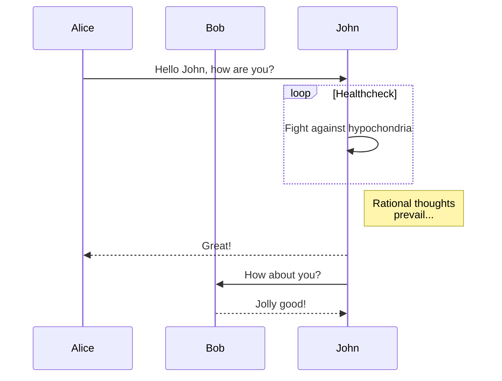

### Gant diagram

```markdown
gantt
    title A Gantt Diagram

    section Section
    A task           :a1, 2014-01-01, 30d
    Another task     :after a1  , 20d
    section Another
    Task in sec      :2014-01-12  , 12d
    anther task      : 24d
```

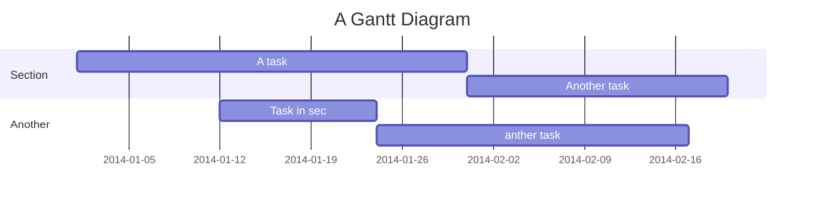

### Pie chart

```markdown
pie
    "Dogs" : 386
    "Cats" : 85
    "Rats" : 15
```

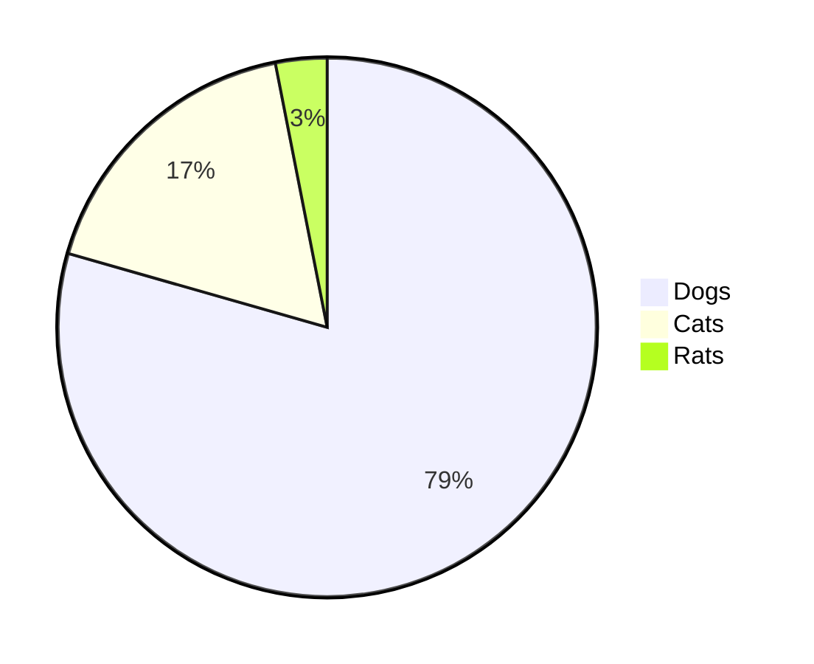

### State diagram

```markdown
stateDiagram
    [*] --> Still
    Still --> [*]
    Still --> Moving
    Moving --> Still
    Moving --> Crash
    Crash --> [*]
```

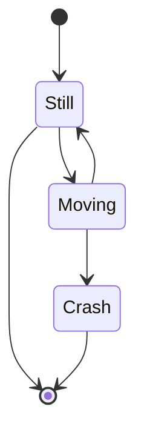
